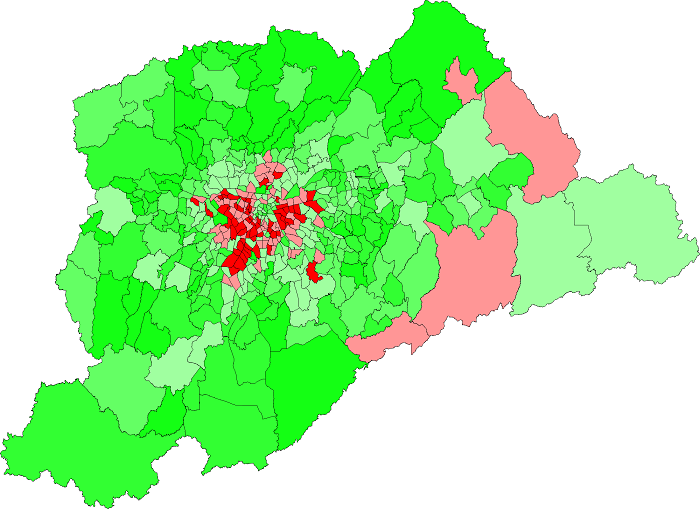
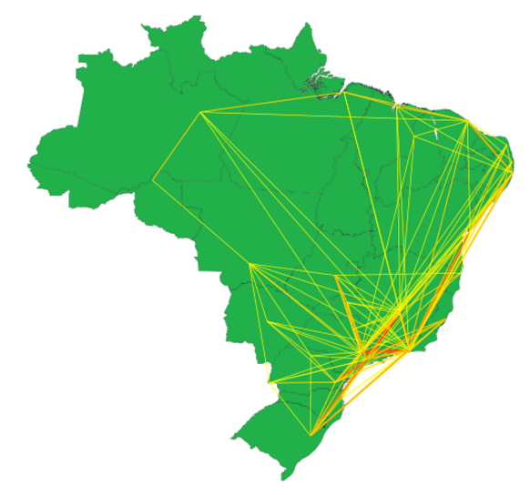

Map x Data Plotting
============
This is a simple project for data visualization with maps using python (on Jupyter Notebook).

It takes in shapefiles (.shp) and data - mainly excel spreadsheets - and plots with color-coding. Basically heatmaps.

Household Tax Variation in São Paulo city - 2014
--------

This is a visual representation of the household tax variation in all of São Paulo city's districts.

Shades of red indicate districts that have suffered a household tax increase in 2014, whereas green shades indicate decreases.

Age Distribution in São Paulo city
--------

This is a heatmap of elder citzens of São Paulo city. You can see central - more traditional - areas of the city have a greater concentration of the elderly.

Whereas, if we plot it for the whole metropolitan areas, we can see other areas in different satellite cities with a greater concentration of elder citzens:

Aerial study - Plane flights among Brazilian airports
--------
This is a visual representation of the most active plane routes among the most movimented passenger routes in Brazil.
It uses public data offered by ANAC (National Agency of Civil Aviation), as well as public shapefiles.
Stronger, bolder red lines indicate high volume of flights on a route, and lighter, thinner yellow lines indicate a route has fewer flights.

